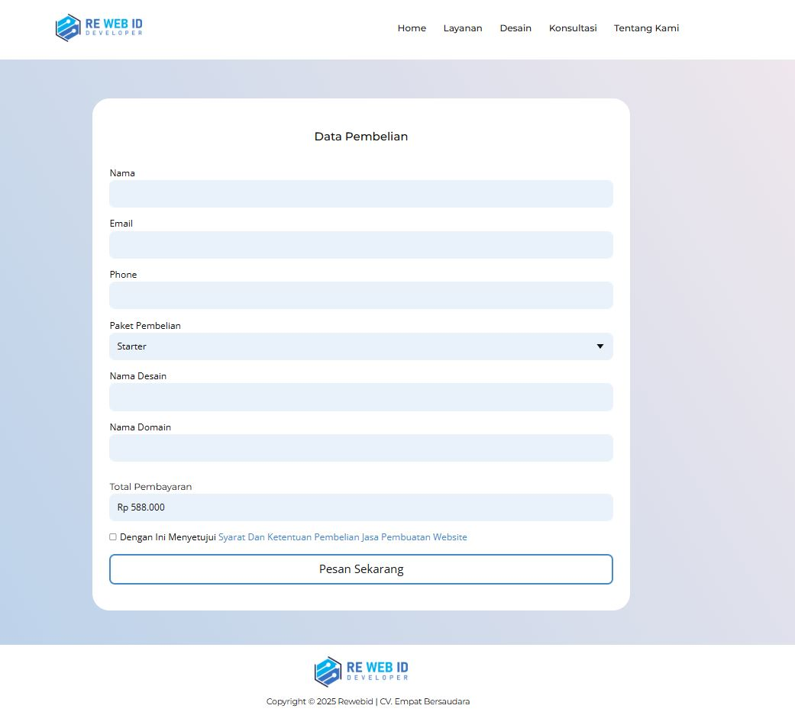
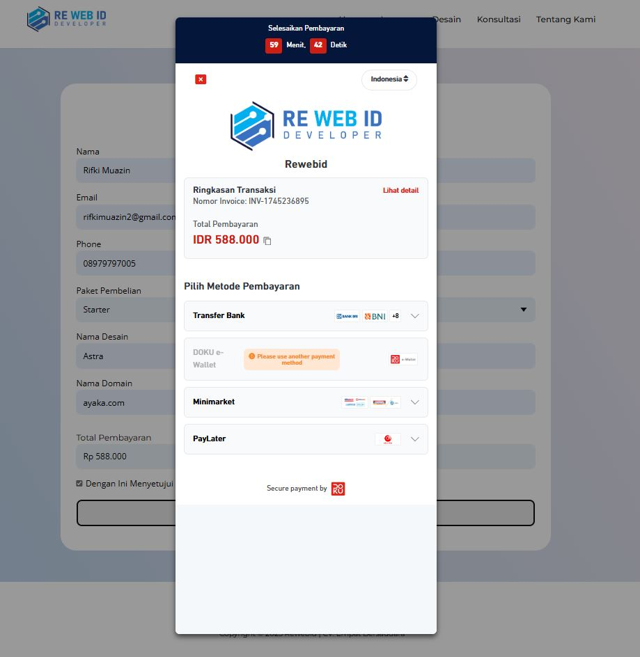

# PHP-Doku-Integration
Doku Integration di website Jasa Pembuatan Website dengan transaksi berisi Form dan Paket Penjualan

**Sebuah contoh halaman pembayaran dengan HTML/CSS + integrasi DOKU API**

## 🔍 Fitur
- Halaman checkout responsive (HTML + CSS modern)
- Integrasi server‑side dengan DOKU API (PHP)
- Contoh process flow & test credentials

## 🚀 Quick Start
1. Persiapan  
   Pastikan Sudah Memiliki akun DOKU
   Persiapkapkan
   Merchant ID dan Shared Key Anda
   Baca Lebih lengkap Doku Dokumentasi
   ```bash
   [asd](https://developers.doku.com/accept-payment/doku-checkout)
   
3. Screenshot System
   Halaman Pembelian
   
   Halaman Staging Doku
   
   
   


